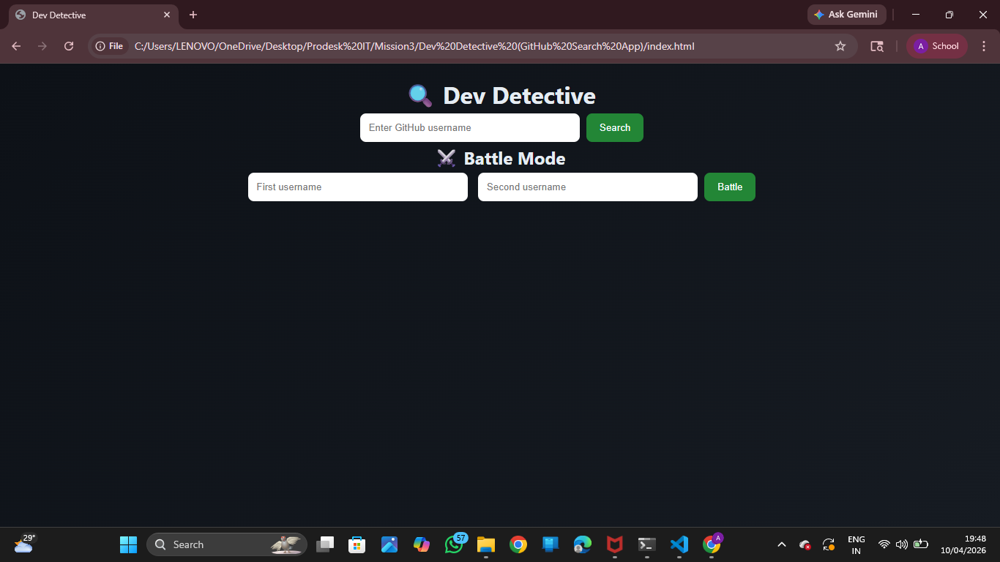
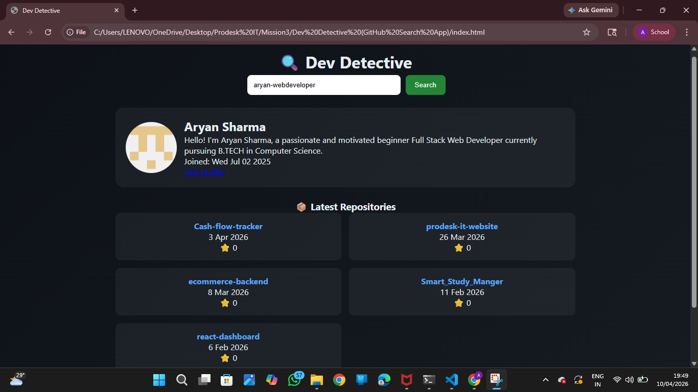

Dev Detective (GitHub Search App)

A modern and responsive web app that allows users to search GitHub profiles, view repositories, and compare developers using real-time API data.

🌐 Live Demo
👉 https://aryan-webdeveloper.github.io/Dev-Detector/

📸 Screenshot

📌 Features
GitHub User Search 🔍
Profile Details (Avatar, Bio, Join Date)
Latest 5 Repositories Display 📦
Clickable Repo Links
Error Handling (User Not Found ❌)
Loading State ⚡
Battle Mode (Compare 2 Users ⚔️)
Total Stars Comparison ⭐
Winner Highlight (Green/Red)
Responsive Design (Mobile + Desktop)

🛠️ Tech Stack
HTML5
CSS3 (Flexbox + Grid)
JavaScript (Fetch API, Async/Await, JSON)

📂 Project Structure
dev-detective/
│
├── index.html
├── style.css
├── script.js
├── README.md
└── Prompts.md

🚀 Deployment
Deployed using GitHub Pages.

👨‍💻 Author
Aryan  
GitHub: https://github.com/ARYAN-WEBDEVELOPER
